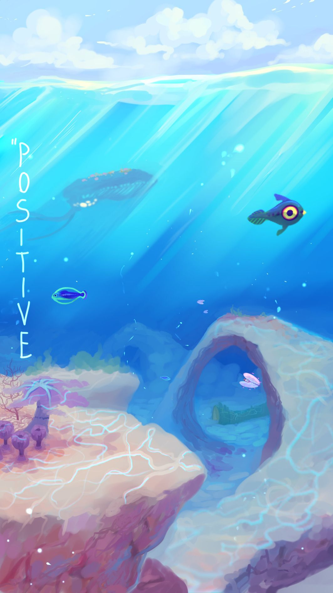

Bonjour, ravi de te rencontrer !

Je m'appelle Simon, j'ai 19 ans et je suis étudiant en BTS SIO option SLAM (Solutions Logicielles et Applications Métier). Ce qui me passionne, c'est le développement web, aussi bien côté front que back, ainsi que la cybersécurité. J'aime comprendre comment une application fonctionne de bout en bout, de l'interface jusqu'à la base de données, et surtout comment la protéger.

J'ai commencé à coder vers 16 ans au lycée avec python sur ma calculatrice. Mon BTS m'a ensuite fait découvrir PHP, SQL et Java, et aujourd'hui je passe le plus clair de mon temps sur JavaScript, PHP et SQL.

Je travaille sur des projets scolaires comme personnels. Parmi ceux dont je suis le plus fier, il y a mon Système de gestion d'accès, un portail en PHP/MySQL avec authentification, gestion des droits utilisateurs et journalisation des accès, pensé dès le départ pour résister aux failles courantes. Je développe aussi une application mobile de gestion de tâches en React Native avec Firebase, synchronisée en temps réel (en cours de développement), et mon portfolio en React et Tailwind CSS.

Ambitions

Je veux concevoir des applications utiles, fiables et sécurisées, celles qu'on utilise au quotidien sans jamais se demander si nos données sont en danger. Je suis actuellement à la recherche d'une alternance en développement web ou en cybersécurité pour l'années scolaire 2027/2028.

Systèmes d'exploitation

J'utilise Windows/Linux au quotidien, mais j'ai travaillé avec tous les OS ci-dessous

OSs

Langages de programmation

Languages

Frameworks & Outils

Tools

Centres d'intérêt
🔐 Curieux de tout ce qui touche à la sécurité informatique : failles web, CTF, bonnes pratiques.
🌊 Fan de Subnautica, fasciné par l'exploration des grands fonds et les jeux de survie.
⚽ Sport
🎧 musique
Me contacter
💼 LinkedIn : simon-grateloube
🌐 Portfolio : simon.sitecreator.shop
📧 Email : sgrateloube@lerebours.fr
N'hésite pas à explorer mes dépôts, je suis toujours ouvert aux collaborations et aux nouvelles opportunités.

> *« Le code est comme l'humour. Quand vous devez l'expliquer, c'est mauvais. »* — Cory House

---

  
**Disponible pour une alternance** 
*Étudiant BTS SIO SLAM - Développement Web & Cybersécurité*

<!--
**Simon-grtl/simon-grtl** is a ✨ _special_ ✨ repository because its `README.md` (this file) appears on your GitHub profile.

Here are some ideas to get you started:

- 🔭 I’m currently working on ...
- 🌱 I’m currently learning ...
- 👯 I’m looking to collaborate on ...
- 🤔 I’m looking for help with ...
- 💬 Ask me about ...
- 📫 How to reach me: ...
- 😄 Pronouns: ...
- ⚡ Fun fact: ...
-->
